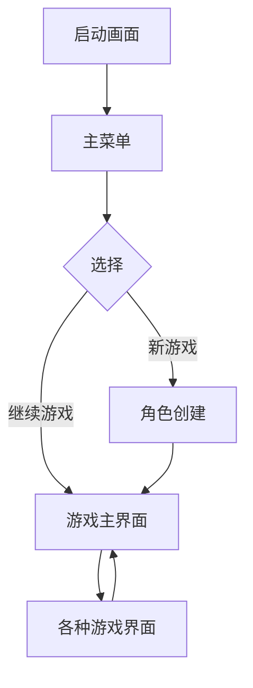
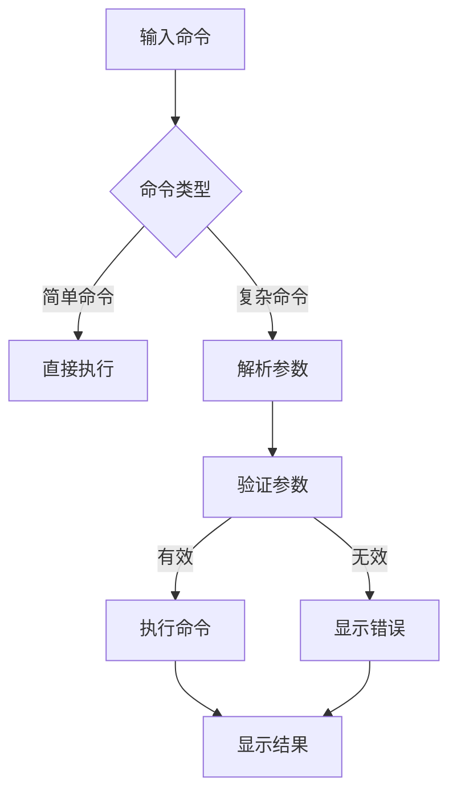

# 微信小游戏MUD量子叙事用户界面设计

## 概述

本文档详细描述了微信小游戏MUD量子叙事项目的用户界面设计。作为一款文字为主的MUD游戏，界面设计注重清晰的信息展示和高效的操作交互，同时适应微信小游戏平台的特性。

## 设计原则

1. **简洁性**：保持界面简洁，突出核心内容
2. **一致性**：统一的操作逻辑和视觉风格
3. **可读性**：确保文本清晰易读
4. **高效性**：减少操作步骤，提高交互效率
5. **适应性**：适配不同屏幕尺寸和设备
6. **无障碍**：考虑色盲、弱视等用户群体的需求

## 界面布局

### 1. 主游戏界面

```
┌──────────────────────────────────────────────┐
│ 游戏标题                                      │
├──────────────────────────────────────────────┤
│                                                │
│  [这里是主要的游戏文本输出区域]                │
│  [显示游戏描述、事件、对话等内容]              │
│  [支持简单的文本格式和颜色]                    │
│                                                │
├──────────────────────────────────────────────┤
│ 命令输入框：[_____]                            │
├──────────────────────────────────────────────┤
│ [状态] [物品] [技能] [任务] [设置]             │
└──────────────────────────────────────────────┘
```

#### 区域说明

1. **标题栏**：显示游戏标题和当前场景名称
2. **主文本区**：显示游戏文本内容，支持滚动查看历史
3. **命令输入框**：玩家输入命令的位置
4. **快捷标签栏**：快速访问常用功能

### 2. 状态界面

```
┌──────────────────────────────────────────────┐
│ 角色状态                                      │
├──────────────────────────────────────────────┤
│ 名称：量子旅人      等级：5                   │
│ 生命：85/100       精神力：60/80              │
│                                                │
│ 属性：                                       │
│ 力量：12 (+2)      敏捷：10                   │
│ 智力：15          感知：14 (+1)               │
│ 魅力：8           量子亲和：20                │
│                                                │
│ 装备：                                       │
│ 武器：量子匕首      护甲：布衣                │
│ 饰品：记忆碎片                               │
└──────────────────────────────────────────────┘
```

### 3. 物品界面

```
┌──────────────────────────────────────────────┐
│ 物品清单 (15/20)                             │
├──────────────────────────────────────────────┤
│ [Q] 量子匕首      装备中     攻击+5            │
│ [W] 布衣          装备中     防御+3           │
│ [E] 记忆碎片      饰品       量子亲和+2       │
│ [R] 治疗药水 x3   消耗品     恢复30生命       │
│ [T] 地图碎片      任务物品                    │
│                                                │
│ 操作提示：                                    │
│ [Q]使用/装备 [E]查看详情 [R]丢弃              │
└──────────────────────────────────────────────┘
```

### 4. 任务界面

```
┌──────────────────────────────────────────────┐
│ 任务日志                                      │
├──────────────────────────────────────────────┤
│ ▶ 主线：记忆的碎片                            │
│   ✓ 前往边缘村庄东部的废墟                   │
│   ✓ 寻找闪烁的光点                           │
│   ◯ 获取记忆碎片                             │
│                                                │
│ ▶ 支线：商人的请求                           │
│   ◯ 收集5个铁锈零件                          │
│   ◯ 交付给铁锈区的商人                       │
│                                                │
│ ▼ 已完成                                      │
│   ✓ 新手引导                                  │
└──────────────────────────────────────────────┘
```

## 交互元素

### 1. 命令输入系统

1. **基础命令输入**：
   - 直接在输入框中输入文本命令
   - 支持命令历史记录（上下箭头切换）
   - 支持命令自动补全（Tab键）

2. **快捷命令按钮**：
   - 常用命令快捷按钮（如"查看"、"交谈"等）
   - 可自定义的快捷命令栏

3. **语音输入支持**：
   - 集成微信语音输入API
   - 语音命令转换为文本执行

### 2. 文本交互

1. **可交互文本**：
   - 特定关键词高亮显示（如物品、NPC名称）
   - 点击高亮文本执行默认命令（如点击NPC名称执行"交谈"）

2. **文本格式化**：
   - 支持颜色标记（如红色表示危险，绿色表示安全）
   - 支持简单排版（如列表、表格）

### 3. 菜单导航

1. **标签式导航**：
   - 底部固定标签栏切换主要界面
   - 滑动切换部分界面

2. **上下文菜单**：
   - 长按元素弹出上下文菜单
   - 提供相关操作选项

## 响应式设计

### 1. 屏幕适配

1. **布局调整**：
   - 根据屏幕尺寸调整字体大小
   - 在小屏幕上隐藏次要信息

2. **横竖屏适配**：
   - 支持横屏和竖屏模式
   - 自动调整布局

### 2. 输入方式适配

1. **键盘输入**：
   - 虚拟键盘布局优化
   - 命令快捷键支持

2. **触摸优化**：
   - 增大点击区域
   - 触摸反馈效果

## 视觉设计

### 1. 色彩方案

1. **主色调**：
   - 背景：深灰（#222222）
   - 文本：浅灰（#EEEEEE）
   - 强调色：量子蓝（#42A5F5）

2. **状态颜色**：
   - 生命值：红色（#F44336）
   - 精神力：紫色（#AB47BC）
   - 量子能量：蓝紫色（#7E57C2）

### 2. 字体选择

1. **主要字体**：
   - 微信默认字体
   - 等宽字体用于对齐文本

2. **字体大小**：
   - 正文：16px
   - 标题：20px
   - 小字：14px

### 3. 动画效果

1. **过渡动画**：
   - 界面切换淡入淡出
   - 文本滚动平滑效果

2. **反馈动画**：
   - 按钮点击效果
   - 命令执行反馈

## 无障碍设计

### 1. 视觉辅助

1. **字体缩放**：
   - 支持系统字体缩放
   - 独立字体大小设置

2. **高对比度模式**：
   - 黑白高对比度主题
   - 色盲友好配色

### 2. 操作辅助

1. **语音反馈**：
   - 重要事件语音提示
   - 文本朗读功能

2. **简化模式**：
   - 减少界面元素
   - 简化操作流程

## 微信小游戏平台特性

### 1. 平台API集成

1. **社交分享**：
   - 游戏进度分享卡片
   - 成就分享功能

2. **排行榜**：
   - 量子能力排行榜
   - 探索进度排行榜

### 2. 平台UI要求

1. **菜单按钮**：
   - 集成微信小游戏菜单按钮
   - 符合平台设计规范

2. **广告位**：
   - 激励视频广告位设计
   - banner广告位置规划

## 界面状态流程

### 1. 游戏主流程



### 2. 命令输入流程



## 原型设计

### 1. 低保真原型

[此处应包含手绘或线框图原型，描述主要界面布局]

### 2. 高保真原型

[此处应包含更详细的视觉设计原型，展示最终效果]

## 实现指南

### 1. 前端组件

1. **文本显示组件**：
   - 支持富文本显示
   - 历史记录管理

2. **输入组件**：
   - 命令输入框
   - 虚拟键盘

### 2. 样式实现

```css
/* 示例样式 */
.game-container {
  background-color: #222222;
  color: #EEEEEE;
  font-family: 'Courier New', monospace;
  padding: 10px;
}

.command-input {
  border: 1px solid #42A5F5;
  background-color: #333333;
  color: white;
  padding: 8px;
}

.highlight-item {
  color: #42A5F5;
  font-weight: bold;
  cursor: pointer;
}
```

### 3. 交互实现

```javascript
// 示例命令处理
function handleCommand(input) {
  const parts = input.trim().split(' ');
  const verb = parts[0].toLowerCase();
  const args = parts.slice(1);
  
  switch(verb) {
    case 'look':
      return handleLookCommand(args);
    case 'go':
      return handleMoveCommand(args);
    // 其他命令...
    default:
      return showError('未知命令');
  }
}
```

## 测试要点

1. **布局测试**：
   - 不同设备尺寸适配
   - 横竖屏切换

2. **交互测试**：
   - 命令输入和执行
   - 界面切换流畅度

3. **性能测试**：
   - 文本渲染性能
   - 界面响应速度

4. **无障碍测试**：
   - 字体缩放功能
   - 语音反馈效果

## 更新日志

| 版本 | 日期       | 修改内容                     |
|------|------------|------------------------------|
| 1.0  | 2023-11-20 | 初始UI设计文档               |
| 1.1  | 2023-11-25 | 添加无障碍设计章节           |
| 1.2  | 2023-11-30 | 完善微信平台集成细节         |

## 结论

本UI设计文档为微信小游戏MUD量子叙事项目提供了全面的界面设计指导，确保游戏在保持MUD游戏传统的同时，提供现代化、易用的用户界面体验。设计考虑了微信小游戏平台的特性，并针对单人开发进行了优化。